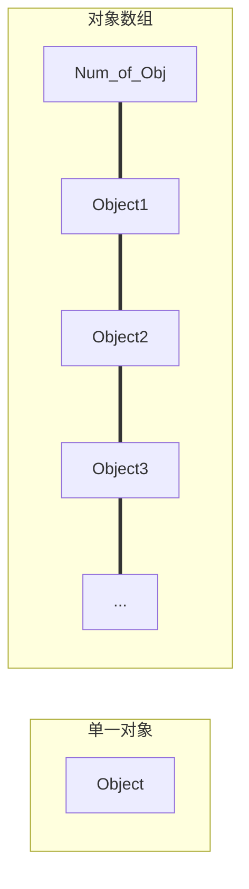

##  条款16：成对使用`new`和`delete`时要采用相同形式

### 一、 `new`和`delete`

### 1. 不匹配的`new`和`delete`

```C++
std::string* stringArray = new std::string[100];
...
delete stringArray;
```

**`stringArray`中的99个不太可能被适当删除**


### 2. `new`和`delete`的作用

#### (1) `new`

##### a. 通过$operator\ new$分配内存

##### b. 针对此内存调用构造函数

#### (2) `delete`

##### a. 针对内存调用析构函数

##### b. 通过$operator\ delete$释放内存

##### c. 单一对象和对象数组之间的差别（方便`delete`判断需要调用多少次析构函数）




### 二、 `new`和`delete`的匹配

### 1. 告知`delete`删除对象是对象数组还是单一对象

```C++
std::string* stringPtr1 = new std::string;
std::string* stringPtr2 = new std::string[100];
...
delete stringPtr1;			//删除一个对象
delete [ ] stringPtr2;		//删除一个对象数组
```

**若调用`new`时使用`[]`，则必须在调用`delete`时使用`[]`**


### 2. 在`typedef`中的调用

```C++
typedef std::string AddressLines[4];	//调用4个string类型数据

std::string* pal = new AddressLines;	//等同于new string[4]

delete pal;			//行为未有定义
delet [ ] pal;		//正确
```

**为避免错误的`new`和`delete`使用，尽量不要对数组形式做`typedef`，可以使用`string`，`vector`等`templates​`**