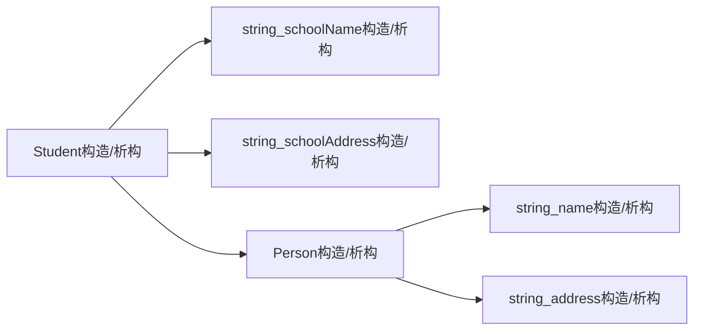

## 条款20：宁以pass-by-reference-to-const替换pass-by -value

### class及其继承体系

```C++
class Person {
public:
    Person();					//为求简化，省略参数
    virtual ~Person();			//条款7
private:
    std::string name;
    std::string address;
};
class Student: public Person {
public:
    Student();
    ~Student();
    ...							//省略参数
private:
    std::string schoolName;
    std::string schoolAddress;
};
```

### 一、 pass-by-value

### 1. 调用

```C++
bool validateStudent(Student s);			//函数以by value方式接受学生
Student plato;
bool platoIsOK = validateStudent(plato);	//调用函数
```


### 2. 调用过程



**总计需要进行六次构造六次析构**


### 二、 pass-by-reference-to-const

### 1. 调用

```C++
bool validateStudent(const Student& s);
```

**不会创建任何新对象，因而也不会调用构造函数和析构函数**

**PS: 由于以by reference方式传递，要保证调用者不会改变传入的`Student`值，`const`是必要的**


### 2. 避免的对象切割的问题

**derived class被视为base class传入时，会仅留下base class对象**

derived class和base class：

```C++
class Window {
public:
    ...
    std::string name() const;				//返回窗口名称
    virtual void display() const;			//显示窗口和其内容
};
class WindowWithSchoolBars: public Window {
public:
    ...
    virtual void display() const;
};
```

**错误示范：**

函数：

```C++
void printNameAndDisplay(Window w)		//错误，参数可能被切割
{
    std::cout << w.name();
    w.display();
}
```

调用：

```C++
WindowWithScrollBars wwsb;
printNameAndDisplay(wwsb);
```

**参数`wwsb`会被构造成`Window`对象，因为它是pass by value，传入过程中会调用base class的构造函数**


**解决方法：**

```C++
void printNameAndDisplay(const Window& w)
{
    std::cout << w.name();
    w.display();
}
```


### 三、 pass-by-reference-to-const和pass-by-value的选择

1. pass-by-value比较适合内置类型（包括STL的迭代器和函数对象）

2. 小型types不必然是pass-by-value的优良选择

> (1) 对象小并不意味着复制成本不高

> (2) 编译器对用户自定义类型和内置类型的态度截然不同，可能导致效率上产生争议

> (3) 作为用户自定义类型，大小容易发生改变

3. **除了内置类型，尽可能以pass-by-reference-to-const替换pass-by-value**