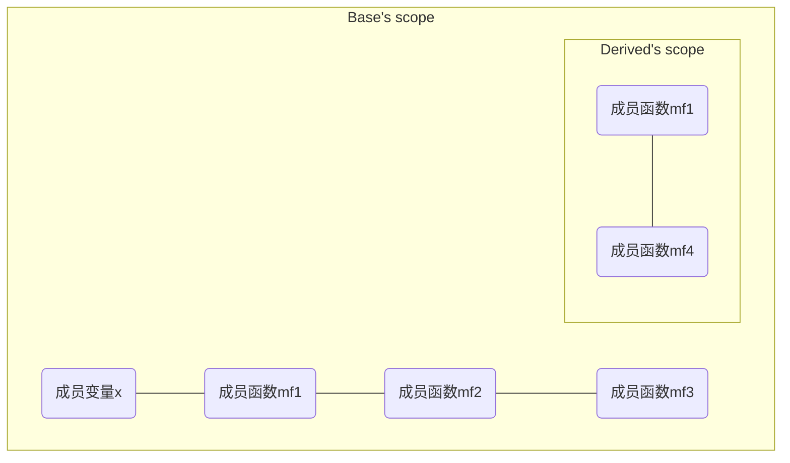
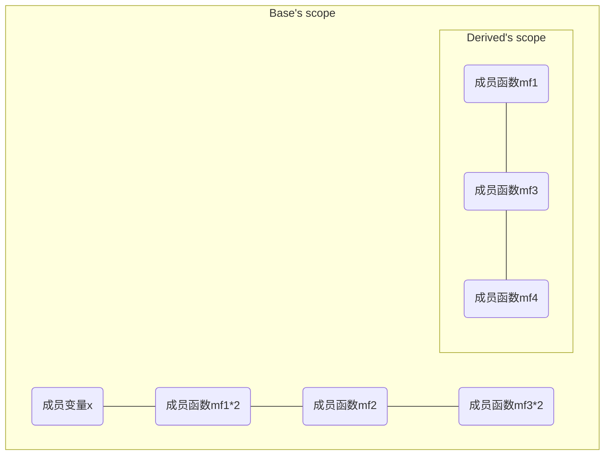

# 避免遮掩继承而来的名称

## $global$ 变量和 $local$ 变量

```C++
int x;					//global变量
void Func()
{
    double x;			//local变量
    std::cin >> x;		//读一个新值赋予local变量
}
```

+ 该读取数据语句指涉的是 $local$ 变量 `x` ，而不是 $global$ 变量 `x`

+ 因为内层作用域会遮掩外围作用域的名称

  ```mermaid
  graph TD
  	subgraph Global scope
  		global_x(x);
  		subgraph Func's scope
  			local_x(x);
          	end
          end
  ```

+ 当编译器在 `Func` 的作用域并遭遇名称 `x` 时，它会**先在 $local$ 作用域查找**这个名称，如果找不到，再在别的作用域查找该名称
+ $C++$ 的名称遮掩规则所做的唯一一件事就是**遮掩名称**，不管名称是否应和相同或不同的类型


## 遮掩继承而来的名称

### 1. $derived\ class$ 和 $Base\ class$ 的作用域

$Base\ class$：

```C++
class Base {
private:
    int x;
public:
    virtual void mf1() = 0;
    virtual void mf2();
    void mf3();
    ...
};
```

$Derived\ class$：

```C++
class Derived: public Base {
public:
    virtual void mf1();
    void mf4();
    ...
};
```

$derived\ class$ 和 $Base\ class$ 作用域：




+ 不管是成员变量还是成员函数，`private` 还是 `public` 成员，都不重要，唯一重要的只有名称

+ $Derived\ class$ 中的 `mf4` ：

    ```C++
    void Derived::mf4()
    {
        ...
        mf2();
        ...
    }
    ```

+ 编译器会先查找 $local$ 作用域（`mf4` 覆盖的作用域），然后查找 `class Derived` 覆盖的作用域，最后查找 `class Base` 覆盖的作用域，找到了 `mf2`，若此时还未找到，会继续深入内含 `class Base` 的 $namespace$ 作用域，直至在 $global$ 作用域查找


### 2. 遮掩继承而来的名称

$Base\ class$：

```C++
class Base {
private:
    int x;
public:
    virtual void mf1() = 0;
    virtual void mf1(int);
    virtual void mf2();
    void mf3();
    void mf3(double);
    ...
};
```

$Derived\ class$：

```C++
class Derived: public Base {
public:
    virtual void mf1();
    void mf3();
    void mf4();
    ...
};
```

$derived\ class$ 和 $Base\ class$ 作用域：



+ `Derived` 重载了 `mf3` ，这是一个继承而来的 $non$-`virtual` 函数，这使得设计疑云重重（[条款36]()）

+ $base\ class$ 中所有 `mf1` 和 `mf3` 都被 $derived\ class$ 覆盖了， `Base::mf1` 和 `Base::mf3` 不再被 `Derived` 继承，不论是否传参是什么类型的函数，都被 `Derived` 内的重名函数遮掩

  ```C++
  Derived d;
  int x;
  ...
  d.mf1();		//没问题，调用Derived::mf1
  d.mf1(x);		//错误，Base::mf1被Derived::mf1遮掩
  d.mf2();		//没问题，调用Base::mf2
  d.mf3();		//没问题，掉用Derived::mf3
  d.mf3(x);		//错误，Base::mf3被Derived::mf3遮掩
  ```

  

### 3. 引入 `using` 声明式

$Derived\ class$：

```C++
class Derived: public Base {
public:
    using Base::mf1;		//让Base class内名为mf1和mf3的所有东西
    using Base::mf3;		//在Derived作用域内都可见（并且public）
    virtual void mf1();
    void mf3();
    void mf4();
    ...
};
```

**继承体制一如既往运作：**

```C++
Derived d;
int x;
...
d.mf1();		//没问题，仍然调用Derived::mf1
d.mf1(x);		//现在没问题，调用Base::mf1
d.mf2();		//没问题，仍然调用Base::mf2
d.mf3();		//没问题，掉用Derived::mf3
d.mf3(x);		//现在没问题，调用Base::mf3
```

若继承 $base\ class$ 并加上重载函数，而又希望重新定义或覆写其中一部分，则需要为原本被遮掩的名称**引入一个 `using` 声明式**


### 4. `inline` 转交函数

+ `public` 不能允许有 $base\ classes$ 的函数未被继承（[条款32](条款32：确定public继承塑模出is-a关系.md)）
+ 但 `private` 继承允许（[条款39]()），而 `using` 声明式会令继承而来的所有同名函数在 $derived\ class$ 都可见
+ 若不想继承所有 $base\ classes$ 的函数，则可以使用 `inline` 转交函数（`inline` 相关可见[条款30](F:\滔天\文件\学校\大学\专业\C++\C++笔记\5.实现\条款30：彻底了解inline.md)）

$Derived\ class$：

```C++
class Derived: public Base {
public:
    virtual void mf1();		//转交函数
    { Base::mf1(); }		//暗自成为inline(见条款30)
    ...
};
```

**调用情况：**

```C++
Derived d;
int x;
d.mf1();			//很好，调用Derived::mf1
d.mf1(x);			//错误，Base::mf1()被遮掩了
```


PS：若继承结合 $templates$ ，将会面对全然不同的形式，此时可见[条款43]()中 “以角括号定界” 的相关内容