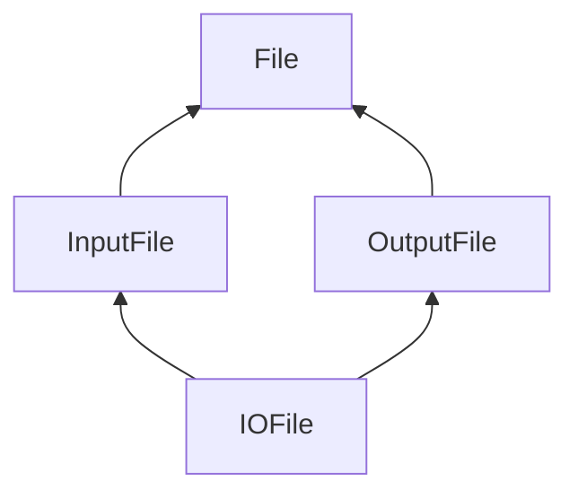

# 条款40：谨慎使用多重继承

## 多重继承的歧义

### 1. 函数调用歧义

```C++
class BorrowableItem {			//图书馆允许你借某些东西
public:
    void checkOut();			//离开时进行检查
    ...
};
class ElectronicGadget {
private:
    bool checkOut() const;		//执行自我检测，返回是否测试成功
    ...
};

class MP3Player:
	public ElectronicGadget,	//多重继承(图书馆借出mp3播放器)
	public BorrowableItem
{ ... };						//内容不是重点

MP3Player mp;
mp.checkOut( );					//歧义，编译器不知道调用哪个checkOut
```

+ 即使其中有一个函数是 `private` 无法取用，此例中对 `checkOut` 的调用会产生歧义

+ 为了解决这个歧义，必须明白指出需要调用哪个 $base\ class$ 内的函数

  ```C++
  mp.BorrowableItem::checkOut();
  ```

+ 当然，如果调用 `ElectronicGadget::checkOut` ，会获得一个 “尝试调用 `private` 成员函数” 的错误


### 2. 钻石型多重继承

**继承一个以上的 $base\ classes$ ，而这些 $base\ classes$ 在继承体系中又有高级的 $base\ classes$ ，便导致 “钻石型多重继承”**

```C++
class File { ... };
class InputFile: public File { ... };
class OutputFile: public File { ... };
class IOFile: public InputFile,
			  public OutputFile
{ ... };
```

图例：



+ 若 `class File` 内有个成员变量 `filename` ， `IOFile` 则会有两种可能

  + 第一种便是从 `InputFile` 和 `OutputFile` 内分别继承两个 `filename` （改状态为缺省情况）

  + 第二种便是只继承一个文件名，需要令带有数据的 `class` ​ 成为  $virtual\ base\ class$ ，因而需要采用 $virtual$ 继承

    ```C++
    class File { ... };
    class InputFile: virtual public File { ... };
    class OutputFile: virtual public File { ... };
    class IOFile: public InputFile,
    			  public OutputFile
    { ... };
    ```

  + $C++$ 标准程序库内含一个多重继承体系，其结构便如下图所示

    ```mermaid
    graph BT
    	basic_iostream --> basic_istream
    	basic_iostream --> basic_ostream
    	basic_istream --virtual--> basic_ios
    	basic_ostream --virtual--> basic_ios
    ```


## $virtual$ 继承

### 1. $virtual$ 继承的选择

+ 从正确性观点来看， `public` 继承总是 $virtual$ ，但 $virtual$ 继承的那些 `class`es 所产生的对象往往比 $non$-$virtual$ 继承的 `class`es 体积要更大，访问速度也更慢
+ 支持 $virtual\ base\ classes$ 初始化的规则比 $non$-$virtual\ bases$ 的情况更复杂： $virtual\ base\ classes$ 的初始化责任是由继承体系中最底层 `class` 负责，这意味着 $derived\ class$ 在初始化时必须认识 $virtual\ base$ ，并且承担其初始化的责任
+ 因而，如非必要，不使用 $virtual$ 继承，如使用 $virtual\ base\ classes$ 则尽可能不要在其中放置数据


### 2. 示例

#### (1) $virtual\ base\ classes$

塑模“人”的 $Interface\ class$ （[见条款31](F:\滔天\文件\学校\大学\专业\C++\C++笔记\5.实现\条款31：降低文件间的编译依存关系.md)）

```C++
class IPerson {
public:
    virtual ~IPerson();
    virtual std::string name() const = 0;
    virtual std::string birthDate() const = 0;
};
```

`IPerson` 的客户使用 $factory\ function$

```C++
//根据独一无二的数据库ID创建一个Person对象
//条款18解释为何不返回原始指针
std::tr1::shared_ptr<IPerson> makePerson(DatabaseID personIdentifier);

//这个函数从使用者手上取得数据库ID
DatabaseID id(askUserForDatabaseID());

//创建对象支持IPerson接口，藉由IPerson成员函数处理*pp
DatabaseID id(askUserForDatabaseID());
std::tr1::shared_ptr<IPerson> pp(makePerson(id));
```


#### (2) 数据库相关 `class` 

该 `class` 提供 `CPerson` 所需要的实质东西

```C++
class PersonInfo {
public:
    explicit PersonInfo(DatabaseID pid);
    virtual ~PersonInfo();
    virtual const char* theName() const;
    virtual const char* theBirthDate() const;
    virtual const char* valueDelimOpen() const;
    virtual const char* valueDelimClose() const;
    ...
};
```

姓名输出的格式以方括号作为缺省状态

```C++
const char* PersonInfo::valueDelimOpen() const
{
    return "[";
}

const char* PersonInfo::valueDelimClose() const
{
    return "]";
}

const char* PersonInfo::theName() const
{
    //保留缓冲区给返回值使用
    static char value[Max_Formatted_Field_Value_Length];
    //写入起始符号
    std::strcpy(value, valueDelimOpen());
    
    ...		//将value内的字符串附加到name成员变量中
    
    //写入结尾符号    
    std::strcat(value, valueDelimClose());
    return value;
}
```

`CPerson` 的实现与继承

```C++
class CPerson: public IPerson, private PersonInfo {		//多重继承
public:
    explicit CPerson(DatabaseID pid): PersonInfo(pid) { }
    virtual std::string name() const;		//实现必要的IPerson成员函数
    { return PersonInfo::theName(); }
    virtual std::string birthDate() const	//实现必要的IPerson成员函数
    { return PersonInfo::theBirthDate(); }
private:
    const char* valueDelimOpen() const { return "";}	//重定义继承而来的	
    const char* valueDelimClose() const { return ""; }	//virtual界限函数
};
```

